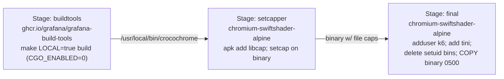

# Build, container & CI

**Sources:** `Dockerfile`, `Makefile`, `scripts/version`,
`.github/workflows/`, `internal/version/version.go`

## Overview

Crocochrome ships as a single container image: a statically-linked Go binary on
top of a Chromium-bearing Alpine base. This page covers how the binary is built,
how the image is assembled (and hardened), how the Makefile orchestrates builds
and tests in a pinned toolchain container, and what CI enforces.

A recurring theme: **the build embeds version info from the git working tree**,
so anything that makes that tree look "dirty" (notably a `.dockerignore`) breaks
version reporting. CI guards against this.

## How the binary learns its version

`internal/version` reads Go's build info (`debug.ReadBuildInfo`) for the module
version, `vcs.revision` (commit), and `vcs.time` (build timestamp). These feed
the startup log line and the `sm_crocochrome_info` metric. For this to be
populated, the build must happen in a clean git checkout with full history —
hence the `.dockerignore` and `fetch-depth: 0` concerns below.

`scripts/version` produces the human-facing version string (used as the image
tag at release time).

## The Dockerfile (multi-stage)



1. **`buildtools`** — `ghcr.io/grafana/grafana-build-tools` (pinned by tag +
   digest). Compiles with `make ... LOCAL=true build` and `CGO_ENABLED=0`
   (the build image is Debian-based; a static binary keeps the final Alpine
   image happy). Honors `TARGETOS`/`TARGETARCH` for multiarch.

2. **`setcapper`** — uses the **same** `chromium-swiftshader-alpine` base as the
   final stage (so no extra image is pulled), installs `libcap`, and runs:

   ```
   setcap cap_setuid,cap_setgid,cap_kill,cap_chown,cap_dac_override,cap_fowner+ep \
       /usr/local/bin/crocochrome
   ```

   These caps let Crocochrome drop privileges, kill the Chromium tree, and set
   up the sandbox files used by sm-k6-runner. See [security.md](security.md) and
   [capabilities.md](../capabilities.md).

3. **`final`** — `ghcr.io/grafana/chromium-swiftshader-alpine` (Chromium +
   SwiftShader software renderer). It:

   - creates user `k6` (UID **6666**, no home, `/bin/nologin`, password disabled);
   - installs `tini` from the Alpine community repo;
   - **deletes every setuid binary** (`find / -type f -perm -4000 -delete`),
     notably `/usr/lib/chromium/chrome-sandbox`, to shrink attack surface
     (necessary because file caps preclude `allowPrivilegeEscalation: false`);
   - copies the binary `--chown=k6:k6 --chmod=0500` so only `k6` (not `nobody`,
     the user Chromium runs as) can read or run the capability-bearing binary;
   - runs as `USER k6` with entrypoint `tini -- /usr/local/bin/crocochrome`
     (tini as PID 1 for signal forwarding and zombie reaping).

The base image tag encodes the Chromium version (e.g.
`147.0.7727.101-r0-3.23.4`); both tag and digest are pinned and updated by
Renovate.

## The Makefile

Build, test, and lint run **inside the `grafana-build-tools` container** by
default, for a reproducible toolchain. Set `LOCAL=true` to run natively
(automatically set when `CI=true`).

| Target                | Command (inside buildtools unless LOCAL)                            | Notes                                                        |
|-----------------------|---------------------------------------------------------------------|--------------------------------------------------------------|
| `build`               | `go build -o dist/crocochrome ./cmd/crocochrome/` (`CGO_ENABLED=0`) |                                                              |
| `test`                | `go test -v ./...`                                                  |                                                              |
| `test-short`          | `go test -v -short ./...`                                           | skips integration                                            |
| `test-integration`    | `go test -v -tags=integration ./integration/...`                    | **not** wrapped in buildtools (needs the host Docker socket) |
| `lint`                | `golangci-lint run ./...`                                           |                                                              |
| `lint-version`        | extract golangci-lint version from the image                        | lets CI download a matching linter                           |
| `build-container`     | `docker build -t test.local/crocochrome .`                          |                                                              |
| `shell`               | open a shell in buildtools                                          | debugging                                                    |
| `clean` / `distclean` | remove artifacts / `git clean -Xf`                                  |                                                              |

The buildtools wrapper mounts the repo, the Go build/module caches, the
golangci-lint cache, `/etc/passwd` (read-only), and `/var/run/docker.sock`, and
runs as the host user (`--user $(id -u):$(id -g)`, `--net=host`). The Docker
socket and host networking are what make `test-integration` (testcontainers)
work — and the reason that one target is not containerized (the socket is
usually not world-readable). See [testing.md](testing.md).

## CI workflows (`.github/workflows/`)

### `push-pr.yaml` — runs on PRs and pushes to `main`

| Job                       | What it does                                                                                                                                                  |
|---------------------------|---------------------------------------------------------------------------------------------------------------------------------------------------------------|
| **Build**                 | `make build`                                                                                                                                                  |
| **Test**                  | `make test` on `ubuntu-latest` and `ubuntu-24.04-arm` (matrix)                                                                                                |
| **Integration tests**     | `make test-integration` on both architectures                                                                                                                 |
| **Build container image** | `docker/build-push-action`, `push: false`, `platforms: linux/amd64,linux/arm64`, GHA cache                                                                    |
| **Lint**                  | `make CI=false LOCAL=false S= lint` (forces the linter to run inside the container so its Go toolchain matches), preceded by the `.dockerignore` sanity check |

#### The `.dockerignore` sanity check

The lint job fails if a `.dockerignore` file exists:

```
if [[ -e ".dockerignore" ]]; then ... exit 1; fi
```

Rationale: `.dockerignore` would stop git-tracked files from being copied into
the build context, making Go see the build tree as dirty and self-report a dirty
version — which breaks the deployment process. (If one were ever truly needed,
`.gitignore` must be a superset and the check updated.)

### `publish-container.yaml` — runs on `v*` tags

Checks out with `fetch-depth: 0` (full history, required by `scripts/version`),
computes the version, sets up QEMU + Buildx (with `cache-binary: false` to avoid
[cache poisoning](https://woodruffw.github.io/zizmor/audits/#cache-poisoning)), logs into `ghcr.io`, and builds+pushes a multiarch
image tagged `ghcr.io/<repo>:<version>` with `context: .` (the full checkout,
not a shallow clone).

### Other workflows

- `publish-techdocs.yaml` — publishes this documentation (mkdocs / Backstage
  TechDocs) from `doc/`.
- `release-please.yml` — automated release PRs / notes.
- `renovate-validate.yaml`, `validate-policy-bot-config.yml` — config validation.

## When to update

- The Dockerfile stages, base images, capability set, user/UID, or hardening
  steps change → update the multi-stage section and the diagram.
- A Makefile target is added/removed or its command changes, or the buildtools
  mount/flag set changes → update the targets table and the wrapper description.
- A CI job is added/removed or its matrix/steps change → update the workflow
  tables.
- The `.dockerignore` policy changes → update that subsection (and note the CI
  job no longer named here will go stale).
- The versioning mechanism (`internal/version`, `scripts/version`) changes →
  update "How the binary learns its version".

