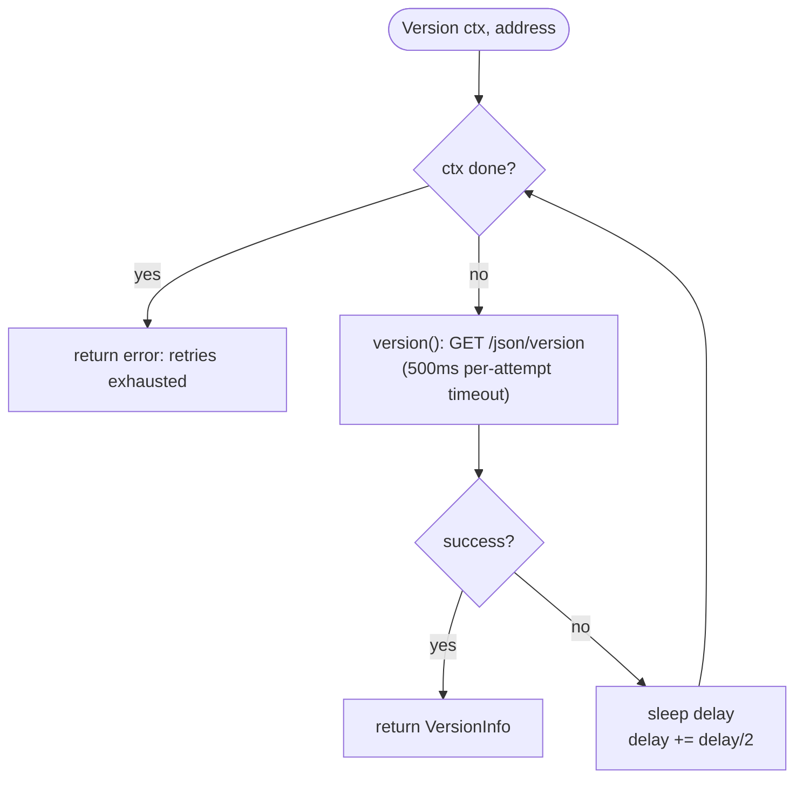

# Chromium readiness client

**Source:** `internal/chromium/chromium.go`

## Overview

This is a deliberately thin HTTP client with one job: decide **when Chromium is
ready** to accept connections, and return its version metadata. After the
[Supervisor](supervisor.md) spawns Chromium, it cannot connect immediately —
the browser takes a moment to start listening. The client polls Chromium's
`/json/version` endpoint until it responds, then hands back the parsed
`VersionInfo`.

That `VersionInfo` is important beyond readiness: it carries the
`webSocketDebuggerUrl` the [HTTP layer](http-api.md) rewrites and proxies, and
the default `User-Agent` the supervisor patches.

## Background: the Chrome DevTools Protocol

Chromium exposes a remote-debugging interface known as the
[Chrome DevTools Protocol (CDP)][cdp]. It has two parts relevant here:

- A small **HTTP** surface for discovery/metadata, including
  `GET /json/version`, which returns a JSON blob describing the browser and the
  WebSocket URL to drive it.
- A **WebSocket** endpoint (the `webSocketDebuggerUrl`) carrying the actual CDP
  commands. Crocochrome never speaks this itself — it proxies it to the client
  (see [http-api.md](http-api.md)).

This client only touches the HTTP `/json/version` part.

[cdp]: https://chromedevtools.github.io/devtools-protocol/

## Code map

| Symbol | Location | Role |
|--------|----------|------|
| `VersionInfo` | `chromium.go` (`type VersionInfo struct`) | parsed `/json/version` response |
| `Client` | `chromium.go` (`type Client struct`) | wraps an `http.Client` |
| `NewClient()` | `chromium.go` | builds a client with a cloned default transport |
| `(*Client) Version(ctx, address)` | `chromium.go` | **public**: poll with backoff until ready or ctx done |
| `(*Client) version(ctx, address)` | `chromium.go` | **private**: a single attempt, with a 500ms timeout |

`VersionInfo` mirrors Chromium's JSON exactly, including the field that is
lowercase in the wire format:

```go
WebSocketDebuggerURL string `json:"webSocketDebuggerUrl"` // /!\ lowercase in JSON
```

## Readiness probe & retry logic

`Version` loops until either it succeeds or the context is cancelled. It uses an
exponential backoff that starts at **100ms** and grows by ×1.5 each iteration
(implemented as integer `delay += delay / 2`). Each individual attempt
(`version`) is bounded by its own **500ms** timeout via `context.WithTimeout`.

The overall deadline is set by the **caller's context**: `Create` and
`ComputeUserAgent` both pass a 2-second context, so the probe gives up after
~2s. On exhaustion, `Version` returns an error wrapping `ctx.Err()`.



A single attempt (`version`) builds `http://<address>/json/version`, issues a
`GET`, and JSON-decodes the body into a `VersionInfo`, closing the body
afterwards. Any error (connection refused, timeout, decode failure) simply
causes another retry in the outer loop.

## Protocols & network boundaries

- Protocol: **HTTP GET** to `/json/version`; the response is JSON.
- The `address` passed in is always `localhost:<ChromiumPort>` — this client only
  ever talks to the co-located Chromium over loopback. It crosses no external
  network boundary.

## Testing

The client is exercised against a mock from `internal/testutil`:
`HTTPInfo(t, handler)` starts an `httptest.Server` serving `GET /json/version`,
and `ChromiumVersionHandler` returns a realistic Chromium response (including a
`webSocketDebuggerUrl`). `InternalServerErrorHandler` simulates a failing
Chromium so the retry/exhaustion path can be tested. See
[testing.md](testing.md).

## When to update

- The backoff parameters (initial 100ms, ×1.5 factor) or the per-attempt 500ms
  timeout change → update the "Readiness probe & retry logic" section and the
  flowchart.
- The probed endpoint changes from `/json/version`, or the request gains headers
  → update the protocols section.
- Fields are added to/removed from `VersionInfo` → update the code map (and note
  the lowercase-JSON gotcha if a similar field appears).
