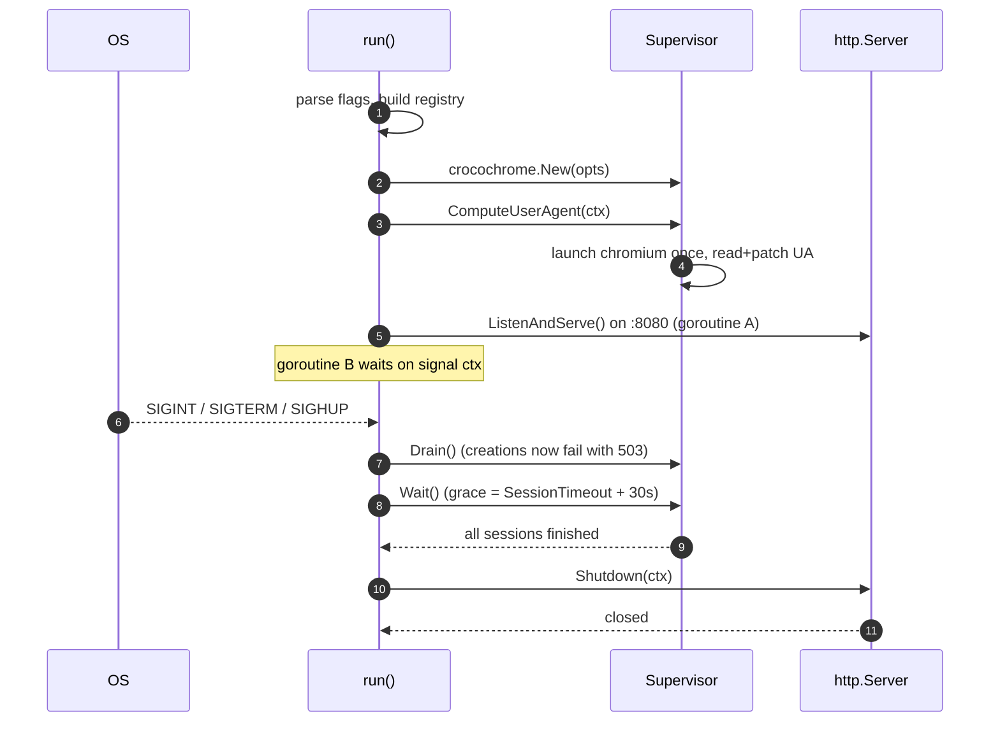

# Entry point & process lifecycle

**Source:** `cmd/crocochrome/main.go`

## Overview

This is the `main` package: the thin layer that wires the pieces together and
owns the process lifecycle. It parses flags, builds the Prometheus registry, the
[Supervisor](supervisor.md), and the [HTTP server](http-api.md), starts
listening, and — crucially — implements a **graceful shutdown** that drains
active browser sessions before closing the HTTP server.

Almost no business logic lives here. If you are looking for _what a session
does_, read [supervisor.md](supervisor.md); this page is about _how the process
starts and stops_.

## Code map

| Symbol                | Location                         | Role                                          |
|-----------------------|----------------------------------|-----------------------------------------------|
| `Config`              | `main.go` (`type Config struct`) | flag-backed configuration                     |
| `main()`              | `main.go`                        | sets up the logger, parses flags, calls `run` |
| `run(logger, config)` | `main.go`                        | wires everything and blocks until shutdown    |

## Configuration (flags)

Flags are parsed in `main()` into a `Config`:

| Flag               | Default                      | Meaning                                               |
|--------------------|------------------------------|-------------------------------------------------------|
| `-temp-dir`        | `/chromium-tmp`              | writable directory Chromium writes its data to        |
| `-user-group`      | `65534` (`nobody` on Alpine) | UID/GID to run Chromium as; set to `0` for local dev  |
| `-process-metrics` | `false`                      | enable per-process RSS collection at session teardown |

Other important values are **hardcoded** in `run`:

- The listen address is `:8080` (`const address = ":8080"`).
- The Chromium binary is `"chromium"` (resolved from `PATH`).
- `ExtraUATerms` is set to `"GrafanaSyntheticMonitoring"`, appended to the
  patched Chromium user agent (see [supervisor.md](supervisor.md#user-agent-patching)).

## Startup sequence

`run` performs, in order:

1. Logs version info (`internal/version`: `Short()`, `Commit()`, `Buildstamp()`).
2. Creates a Prometheus registry and registers build-info metrics
   (`metrics.AddVersionMetrics`).
3. Constructs the `Supervisor` (`crocochrome.New`) with the configured options.
4. Calls `supervisor.ComputeUserAgent(ctx)` — this launches Chromium **once** at
   startup to read and patch its default user agent. If this fails, `run`
   returns an error and the process exits.
5. Builds the HTTP handler (`crocohttp.New`) and wraps it with Prometheus
   instrumentation (`metrics.InstrumentHTTP`).
6. Registers `/metrics` (the Prometheus handler) and `/` (the instrumented app)
   on a `http.ServeMux`.
7. Installs a signal-aware context and runs two goroutines via `errgroup`.

## Graceful shutdown

This is the most subtle part of the file and worth understanding before changing
it.

A signal-aware context is created with
`signal.NotifyContext(ctx, SIGINT, SIGTERM, SIGHUP)`, and two goroutines run
under an `errgroup`:

- **Goroutine A** runs `server.ListenAndServe()`. When the server is shut down
  cleanly it returns `http.ErrServerClosed`, which is treated as a non-error
  (returns `nil`).
- **Goroutine B** waits for the context to be cancelled (a signal), then:
  1. Calls `supervisor.Drain()`, so all subsequent session creations fail
     (the HTTP layer maps this to `503 Service Unavailable`). Existing
     sessions are unaffected. From this point the session count can only
     decrease.
  2. Builds a `graceCtx` with a grace timeout **derived from the session
     timeout**: `graceTime := supervisor.SessionTimeout() + 30*time.Second`,
     using `context.WithoutCancel(ctx)` so the already-cancelled signal
     context does not immediately abort it. Because draining bounds the
     active session's remaining lifetime by its own timeout, this grace is
     sufficient by construction; the 30s margin covers post-kill teardown.
  3. Calls `supervisor.Wait()` in a goroutine and waits for either that to
     finish or the grace timeout to elapse.
  4. **Only then** calls `server.Shutdown()`, with its own short bound
     (`const httpShutdownGraceTime = 10 * time.Second`) — flushing in-flight
     HTTP requests is unrelated to session lifetime.

The grace derivation has implications **outside this binary**: the
environment must allow the process at least
`graceTime + httpShutdownGraceTime` to shut down after SIGTERM. On
Kubernetes, `terminationGracePeriodSeconds` must be at least that (~360s with
the default 5m session timeout); the Kubernetes default of 30s would SIGKILL
the process long before the grace elapses.

### Why shut down the HTTP server _after_ draining sessions

The ordering is deliberate (see the comment in `run`): if the server stopped
listening first, clients would lose the ability to `DELETE` their lingering
sessions. By draining sessions first, in-flight checks get a chance to finish and
clean up. `Drain()` closes what used to be an accepted race here: new sessions
can no longer be created in the window before the server stops.

`context.WithoutCancel` is used for both the grace and shutdown contexts so that
the cancellation that _triggered_ shutdown does not also cancel the shutdown
work itself.

## When to update

- A flag is added/removed/renamed, or a default changes → update the flags table.
- The listen address, Chromium binary name, or `ExtraUATerms` stops being
  hardcoded or changes value → update the "Configuration" section.
- The grace derivation (`SessionTimeout + margin`) or the HTTP shutdown bound
  changes → update the graceful-shutdown section, including the
  `terminationGracePeriodSeconds` guidance.
- The shutdown ordering (drain-then-close) changes → revise the "Why shut down
  the HTTP server after draining sessions" section, as this is a deliberate
  design decision others may rely on.
- The startup steps change (e.g. `ComputeUserAgent` moves or is removed) →
  update the startup sequence list and diagram.

