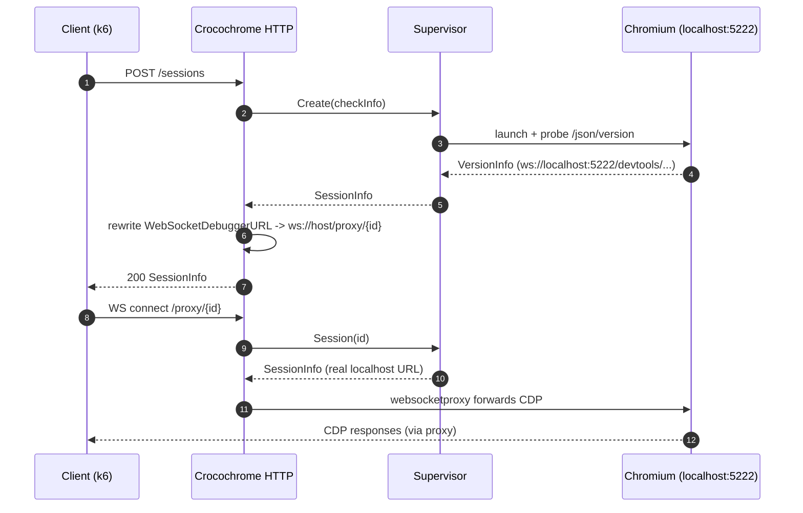

# HTTP API & WebSocket proxy

**Source:** `internal/http/http.go` (tests: `internal/http/http_test.go`)

## Overview

This package is Crocochrome's public surface. It exposes a small REST-ish API to
create, list, and delete browser sessions, plus a WebSocket **proxy** endpoint
that lets a client speak the [Chrome DevTools Protocol](https://chromedevtools.github.io/devtools-protocol/) to Chromium without
Chromium being directly reachable.

The package is intentionally thin: it decodes/encodes JSON, maps results to HTTP
status codes, and delegates all real work to the [Supervisor](supervisor.md). It
holds no session state of its own.

## Code map

| Symbol                    | Location                         | Role                                                                    |
|---------------------------|----------------------------------|-------------------------------------------------------------------------|
| `Server`                  | `http.go` (`type Server struct`) | holds the logger, the `*crocochrome.Supervisor`, and a `*http.ServeMux` |
| `New(logger, supervisor)` | `http.go`                        | builds the mux and registers routes; returns `*Server`                  |
| `(*Server) ServeHTTP`     | `http.go`                        | implements `http.Handler`; logs and delegates to the mux                |
| `(*Server) List`          | `http.go`                        | `GET /sessions`                                                         |
| `(*Server) Create`        | `http.go`                        | `POST /sessions`                                                        |
| `(*Server) Delete`        | `http.go`                        | `DELETE /sessions/{id}`                                                 |
| `(*Server) Proxy`         | `http.go`                        | `/proxy/{id}` WebSocket proxy                                           |

Routing uses the standard library `http.ServeMux` with Go 1.22+ method+pattern
syntax — no third-party router:

```go
mux.HandleFunc("GET /sessions", api.List)
mux.HandleFunc("POST /sessions", api.Create)
mux.HandleFunc("DELETE /sessions/{id}", api.Delete)
mux.HandleFunc("/proxy/{id}", api.Proxy)
```

## Routes

| Method   | Path             | Handler  | Success                    | Notable failures                                     |
|----------|------------------|----------|----------------------------|------------------------------------------------------|
| `GET`    | `/sessions`      | `List`   | `200` + JSON array of IDs  | —                                                    |
| `POST`   | `/sessions`      | `Create` | `200` + `SessionInfo` JSON | `500` if Supervisor fails to start Chromium          |
| `DELETE` | `/sessions/{id}` | `Delete` | `200` (default)            | `400` if ID empty, `404` if not found                |
| (any)    | `/proxy/{id}`    | `Proxy`  | WS upgrade                 | `400` empty ID, `404` unknown session, `500` bad URL |

### Request / response shapes

`POST /sessions` accepts an optional `crocochrome.CheckInfo` body (see
[supervisor.md](supervisor.md)):

```json
{ "type": "browser", "metadata": { "regionID": "...", "tenantID": "...", "id": "..." } }
```

The body is tolerated when malformed or absent: `Create` only decodes JSON when
`Content-Type: application/json` is set, and falls back to a zero-value
`CheckInfo` otherwise (backwards compatibility — older clients send no body).

The response is a `crocochrome.SessionInfo`:

```json
{
  "id": "a1b2c3d4e5f6",
  "chromiumVersion": {
    "Browser": "HeadlessChrome/124.0.6367.207",
    "Protocol-Version": "1.3",
    "User-Agent": "...",
    "V8-Version": "...",
    "WebKit-Version": "...",
    "webSocketDebuggerUrl": "ws://<your-host>/proxy/a1b2c3d4e5f6"
  }
}
```

Note the `webSocketDebuggerUrl` field name is lowercase in JSON (it mirrors
Chromium's own `/json/version` output).

## The WebSocket proxy — why it exists

Recent Chromium versions refuse to bind the remote-debugging port to anything
other than `localhost`, so Chromium is unreachable from outside the container.
Crocochrome bridges this gap in two steps:

1. **URL rewriting (in `Create`).** Chromium reports a debugger URL like
   `ws://localhost:5222/devtools/browser/<uuid>`. Before returning the
   `SessionInfo`, `Create` overwrites `ChromiumVersion.WebSocketDebuggerURL`
   with a URL pointing back at Crocochrome itself:

   ```go
   proxyUrl := url.URL{ Scheme: "ws", Host: r.Host, Path: path.Join("proxy", session.ID) }
   ```

   `r.Host` is reused so the scheme/host/port match however the client reached
   Crocochrome (which is the only thing guaranteed correct).

2. **Proxying (in `Proxy`).** When the client connects to `/proxy/{id}`, the
   handler looks up the session via `supervisor.Session(id)`, parses Chromium's
   _real_ localhost debugger URL from the stored `SessionInfo`, and hands the
   connection to `websocketproxy.WebsocketProxy` (from
   `github.com/koding/websocketproxy`), which forwards traffic both ways.



## Protocols & network boundaries

- The API speaks **HTTP/1.1 with JSON** bodies.
- `/proxy/{id}` performs a **WebSocket upgrade** and then carries opaque CDP
  frames; Crocochrome does not inspect CDP payloads.
- All of this is served on the single `:8080` listener (see
  [entrypoint-and-lifecycle.md](entrypoint-and-lifecycle.md)). Chromium's port
  is never exposed beyond `localhost`.

## Observability

The handler returned by `New` is wrapped by `metrics.InstrumentHTTP` in
`main.go`, which records `sm_crocochrome_requests_total` and
`sm_crocochrome_request_duration_seconds`, both labeled by HTTP status `code`.
`ServeHTTP` also emits a debug log line per request. See
[observability.md](observability.md).

## When to update

- A route is added/removed or its method/path changes → update the routes table
  and the `mux.HandleFunc` snippet.
- The status-code mapping changes (e.g. `Delete` starts returning `204`) →
  update the routes table.
- The request/response JSON shape changes (fields added to `CheckInfo` or
  `SessionInfo`) → update the example payloads (and cross-check
  [supervisor.md](supervisor.md), which owns those types).
- The proxy mechanism changes (different library, or Chromium becomes directly
  reachable) → rewrite the "WebSocket proxy" section and the sequence diagram.

