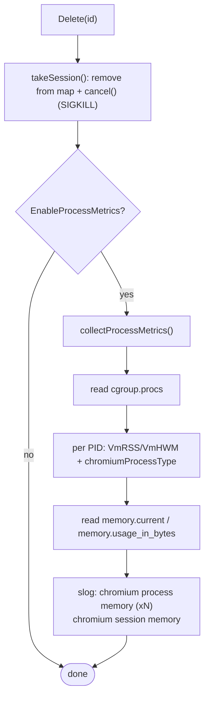

# Observability

**Sources:** `internal/metrics/metrics.go`, `internal/crocochrome/proc.go`,
`internal/crocochrome/cgroup.go`, and logging throughout
`internal/crocochrome/crocochrome.go`.

> For the **operational** view (what the telemetry means, example Loki queries,
> how to interpret memory numbers), see the existing
> [Chromium Observability](../chromium-observability.md) doc. This page is the
> _architectural_ view: where the telemetry is defined and emitted in the code.

## Overview

Crocochrome exposes three observability channels:

1. **Prometheus metrics** under the `sm_crocochrome_*` namespace, scraped at
   `/metrics`.
2. **Structured JSON logs** via `log/slog`, enriched per session.
3. **Optional per-process memory telemetry** emitted as log lines at session
   teardown (behind the `-process-metrics` flag).

## Metrics

All metrics use namespace `sm` + subsystem `crocochrome` (constants `metricNs`
and `metricSubsystemCrocochrome` in `metrics.go`).

| Metric                                       | Type          | Labels                                                | Defined in          | Meaning                                                                |
|----------------------------------------------|---------------|-------------------------------------------------------|---------------------|------------------------------------------------------------------------|
| `sm_crocochrome_requests_total`              | counter vec   | `code`, `method`, `route`                             | `InstrumentHTTP`    | HTTP requests by status, method, and route pattern                    |
| `sm_crocochrome_request_duration_seconds`    | histogram vec | `code`, `method`, `route`                             | `InstrumentHTTP`    | request latency; exp. buckets 0.5–60s (16)                             |
| `sm_crocochrome_info`                        | gauge         | const: `version`, `commit`, `timestamp`               | `AddVersionMetrics` | build info; always `1`                                                 |
| `go_build_info`                              | gauge         | (stdlib)                                              | `AddVersionMetrics` | standard Go build-info collector                                       |
| `sm_crocochrome_session_active`              | gauge         | —                                                     | `Supervisor`        | `1` while a session is active, `0` otherwise (boolean; see below)      |
| `sm_crocochrome_sessions_created_total`      | counter       | —                                                     | `Supervisor`        | sessions successfully created                                          |
| `sm_crocochrome_sessions_terminated_total`   | counter vec   | `reason` (`deleted`/`timeout`/`replaced`)             | `Supervisor`        | sessions ended, by termination path (see below)                        |
| `sm_crocochrome_session_duration_seconds`    | histogram     | —                                                     | `Supervisor`        | session lifespan; exp. buckets 0.5–120s (16), native histogram enabled |
| `sm_crocochrome_chromium_executions_total`   | counter vec   | `state` (`finished`/`failed`)                         | `Supervisor`        | Chromium process exits by outcome                                      |
| `sm_crocochrome_chromium_resource_usage`     | histogram vec | `resource` (`rss`)                                    | `Supervisor`        | max RSS per execution (bytes); linear buckets 0–1024 MiB               |
| `sm_crocochrome_chromium_oom_kills_total`    | counter       | —                                                     | `Supervisor`        | kernel OOM-killer fires within the cgroup during a session             |

### Session lifecycle metrics

`session_active` is deliberately a **boolean**, not a session count: when a
fleet of crocochrome instances is used as a browser pool, the fleet busy-ratio
is simply `avg(sm_crocochrome_session_active)` across instances, with no
assumption about per-instance capacity baked into the queries.

`sessions_terminated_total{reason}` distinguishes the three teardown paths:
`deleted` (explicit client `DELETE`), `timeout` (the session timeout reaper
fired), and `replaced` (killed by `Create`'s kill-existing semantics). A
sustained rate of `timeout` terminations means clients are not releasing
their sessions — for pool deployments, this is the primary signal that
explicit releases are failing to arrive and capacity is being reclaimed only
by the reaper.

All three are updated by the supervisor's `setSessionActive` /
`setSessionInactive(reason)` helpers, atomically with the session-map
mutation while holding the sessions mutex, so the gauge and counters can
never be observed out of sync with the map.

### Where metrics are wired and emitted

- **HTTP metrics** (`requests_total`, `request_duration_seconds`) are registered
  and attached by `metrics.InstrumentHTTP(reg, handler, route)`, called from
  `main.go` with `crocohttp.Route` as the route classifier. The `route` label
  is always a route pattern from a bounded set (`/sessions`,
  `/sessions/acquire`, `/sessions/{id}`, `/proxy/{id}`, `unknown`), never a
  raw path, so session IDs cannot create unbounded cardinality.
- **Version metrics** (`info`, `go_build_info`) are registered by
  `metrics.AddVersionMetrics(reg)`, also from `main.go`, sourced from
  `internal/version`.
- **Supervisor metrics** are created by `metrics.Supervisor(reg)` which returns a
  `*SupervisorMetrics` struct (`SessionDuration`, `ChromiumExecutions`,
  `ChromiumResources`, `SessionActive`, `SessionsCreated`,
  `SessionsTerminated`, `OOMKills`). The session lifecycle metrics are updated
  at the session-map mutation points (see the section above); the rest are
  observed in `Supervisor.launch` (see [supervisor.md](supervisor.md)):
  - `SessionDuration.Observe(...)` in a `defer`, measuring wall time around
    `cmd.Run()`.
  - `ChromiumResources` observes `Rusage.Maxrss` (converted KiB → bytes) from
    `cmd.ProcessState.SysUsage()`.
  - `ChromiumExecutions` is incremented with `state="failed"` when Chromium
    exits with an unexpected error (and the ctx was not simply cancelled), or
    `state="finished"` otherwise.
  - `OOMKills.Add(delta)` when the cgroup OOM counter increased during the
    session (see below).

The `requests_total`/`request_duration_seconds` histograms enable Prometheus
**native histograms** for session duration and resource usage
(`NativeHistogramBucketFactor` etc.).

## Logging

Logging uses the standard library `log/slog` with a **JSON handler** writing to
stderr at `LevelDebug` (configured in `main.go`).

Per session, `Create` builds a child logger via `logger.With("sessionID", id)`
and then enriches it with the **allowlisted** metadata keys — `regionID`,
`tenantID`, and `id` (the `allowedLabels` slice in `crocochrome.go`). Only these
keys from `CheckInfo.Metadata` are attached; together they identify the
organization responsible for the check. This session logger is stored on the
`session` struct so goroutines that outlive `Create` (e.g. teardown) keep the
context.

Chromium's stdout/stderr are captured into buffers and logged only on error, or
always when the level is debug, to avoid log spam (`launch`).

## Process metrics & OOM detection

These are Linux-specific (`/proc` and cgroup files) and live in `proc.go` and
`cgroup.go`.

### OOM-kill detection (`cgroup.go`)

The cgroup memory events file path is resolved by
`detectCgroupMemoryEventsPath(procRoot)`:

1. cgroups **v2**: `/sys/fs/cgroup/memory.events` if it exists.
2. cgroups **v1**: derive `/sys/fs/cgroup/memory/<hierarchy>/memory.oom_control`
   from `/proc/self/cgroup` (via `prometheus/procfs`).

`readOOMKillCount(path)` parses the `oom_kill <N>` line from that file (both v1
and v2 use the same line format). It returns `0` (no error) when the path is
empty or the file is absent — common in test environments, which is why OOM
detection is a no-op there.

`launch` samples the counter **before** and **after** `cmd.Run()` and adds the
positive delta to `sm_crocochrome_chromium_oom_kills_total`. It guards against a
failed baseline read (skips the comparison to avoid false positives) and against
a decreased counter (logged as a warning — counter reset / cgroup recreated).

### Per-process memory (`proc.go`, opt-in)

When `EnableProcessMetrics` is set, `Delete` → `emitTeardownObservability`
collects, after SIGKILL, per-process stats and a cgroup-level total via
`collectProcessMetrics(cgroupEventsPath, procRoot)`:

- Reads PIDs from `cgroup.procs` (alongside the events file).
- For each PID, reads `VmRSS` (current) and `VmHWM` (peak) from
  `/proc/<pid>/status` (`processMemoryStats`, using `prometheus/procfs`).
- Classifies each PID with `chromiumProcessType(pid, procRoot)`, which parses
  `/proc/<pid>/cmdline`. Chromium uses two cmdline layouts (null-separated for
  exec-spawned processes; a single space-separated string for Zygote-spawned
  renderers/GPU/utility after `SetProcessTitleFromCommandLine`), so `--type=` is
  matched as a raw substring. Processes without `--type=` are classified by
  executable basename into `tini`, `crocochrome`, `crashpad`, or `browser`
  (order matters — tini's cmdline contains "crocochrome").
- Reads the cgroup total from `memory.current` (v2) or `memory.usage_in_bytes`
  (v1) — more accurate than summing per-process RSS, which double-counts shared
  pages.

Processes that exit between enumeration and read (ENOENT) are skipped silently —
expected, because collection happens just after SIGKILL.

The results are emitted as `slog` lines: one `"chromium process memory"` entry
per process (`pid`, `processType`, `rss`, `peakRSS`) and one
`"chromium session memory"` summary (`cgroupRSS`, `processCount`).
`context.Background()` is used intentionally for these log calls because the
session context is already cancelled and some slog handlers suppress output on a
done context.

## When to update

- A metric is added/removed/renamed, or its labels/buckets change → update the
  metrics table and the "where emitted" notes.
- The log enrichment allowlist (`allowedLabels`) changes → update the Logging
  section.
- The OOM detection paths/format or the before/after sampling logic change →
  update the OOM section.
- The process classification logic (`chromiumProcessType`) or the set of process
  types changes → update the per-process memory section.
- Operational interpretation guidance changes → update
  [chromium-observability.md](../chromium-observability.md) instead.

