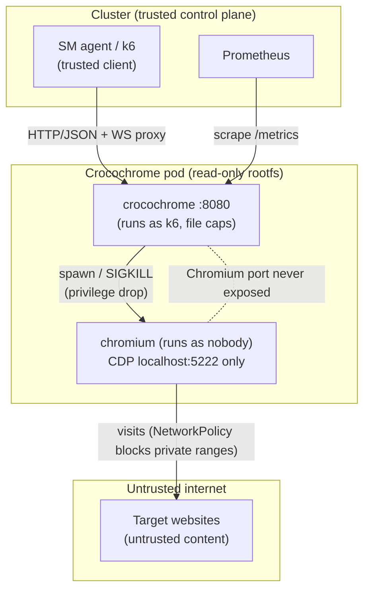

# Security model

**Sources (authoritative deep dives):** [On chromium sandboxing](../chromium-sandbox.md),
[On linux capabilities](../capabilities.md). Implementation:
`Dockerfile`, `internal/crocochrome/crocochrome.go` (`launch`).

## Overview

Crocochrome runs a **browser that executes untrusted content** (the pages a
Synthetic Monitoring check visits), so its security posture matters. The design
choice that shapes everything is that Crocochrome does **not** rely on
Chromium's own sandbox. Instead it leans on container- and OS-level isolation.
This page explains the threat model, the mitigations, and the network
boundaries, and points to the two reference docs for the full reasoning.

## Why `--no-sandbox`

Chromium's sandbox isolates renderer processes (which run untrusted JS) from
each other, the network, and the filesystem. Enabling it requires **user
namespaces** (or a setuid helper), and neither is reliably available in
Crocochrome's deployment environments:

- Docker blocks `clone(CLONE_NEWUSER)` via its default seccomp policy.
- Kubernetes support varies by container runtime.

Rather than depend on something unavailable, Crocochrome runs Chromium with
`--no-sandbox` and replaces the sandbox's guarantees with container-level ones.
The full analysis — including `strace` evidence of the differences between Docker
and Kubernetes — is in [chromium-sandbox.md](../chromium-sandbox.md).

## Compensating controls

Chromium's sandbox protects three things; here is how Crocochrome covers each
without it:

| Sandbox concern | Crocochrome's mitigation |
|-----------------|--------------------------|
| **Process isolation** | Only **one** Chromium runs at a time, as the sole unprivileged process in the container. There are no peer workloads to isolate it from. |
| **Filesystem** | The container runs with a **read-only root filesystem**. Chromium can write only to `/chromium-tmp` (via `TMPDIR`), and the Crocochrome binary is `0500`, owned by `k6` — **not readable or runnable** by the user Chromium runs as. |
| **Network** | A Kubernetes `NetworkPolicy` is expected to forbid the container from reaching **private IP ranges**, limiting SSRF-style abuse. |

These are the same points made in the project README, made concrete by the
[Dockerfile](build-and-packaging.md).

### Defense-in-depth in the image

The [container build](build-and-packaging.md) adds further hardening:

- Runs as a dedicated non-root user `k6` (UID 6666), no shell, no home.
- **Deletes all setuid binaries** (`find / -perm -4000 -delete`), including
  `/usr/lib/chromium/chrome-sandbox`, removing a privilege-escalation vector.
- `tini` as PID 1 for correct signal handling and zombie reaping.

## Privilege model: capabilities & dropping privileges

Crocochrome needs a few privileged operations even though it runs as non-root:

- **Drop privileges** when spawning Chromium — it sets
  `syscall.SysProcAttr.Credential` to run the browser as another UID/GID
  (`nobody`, UID 65534 by default), which needs `cap_setuid` / `cap_setgid`.
- **Kill** the Chromium process tree on teardown/timeout (`cap_kill`).
- **Set up sandbox files** for sm-k6-runner (`cap_chown`, `cap_dac_override`,
  `cap_fowner`).

These capabilities are granted to the **binary** via `setcap ...+ep` in the
Dockerfile.

### The `allowPrivilegeEscalation` caveat

File capabilities and Kubernetes' recommended `allowPrivilegeEscalation: false`
are **mutually incompatible**: setting it to `false` enables `no_new_privs`,
which strips file capabilities. So Crocochrome **must not** set
`allowPrivilegeEscalation: false`, and the same capabilities must *also* be added
to the container's `securityContext` (or the CRI refuses to start it). Deleting
the setuid binaries (above) is the compensating control for keeping
`allowPrivilegeEscalation` enabled. The full Kubernetes `securityContext`
guidance is in [capabilities.md](../capabilities.md).

## Network boundaries & trust zones

- The only inbound listener is `:8080`. Chromium's debug port stays on
  `localhost` and is reachable only via the authenticated-by-possession session
  ID through `/proxy/{id}`.
- Outbound traffic from Chromium to the internet is the intended function, but
  is fenced off from internal/private ranges by `NetworkPolicy`.

> **Note:** Crocochrome's API itself has **no authentication**. It is designed to
> run as a per-tenant sidecar/backend reachable only from trusted clients within
> the cluster; network-level controls, not application auth, gate access.

## When to update

- The sandboxing decision or its compensating controls change → update "Why
  `--no-sandbox`" and the compensating-controls table, and reconcile with
  [chromium-sandbox.md](../chromium-sandbox.md).
- The capability set, the privilege-drop mechanism, or the
  `allowPrivilegeEscalation` guidance changes → update the privilege-model
  section and reconcile with [capabilities.md](../capabilities.md).
- A new listening port, exposed endpoint, or authentication mechanism is added →
  update the network-boundaries diagram and the no-auth note.
- Image hardening steps (setuid deletion, user, tini) change → update the
  defense-in-depth list (and [build-and-packaging.md](build-and-packaging.md)).
