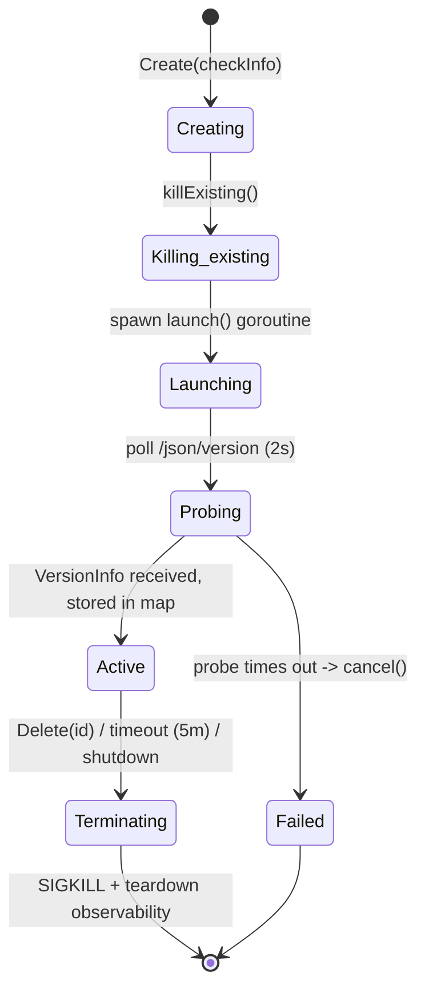
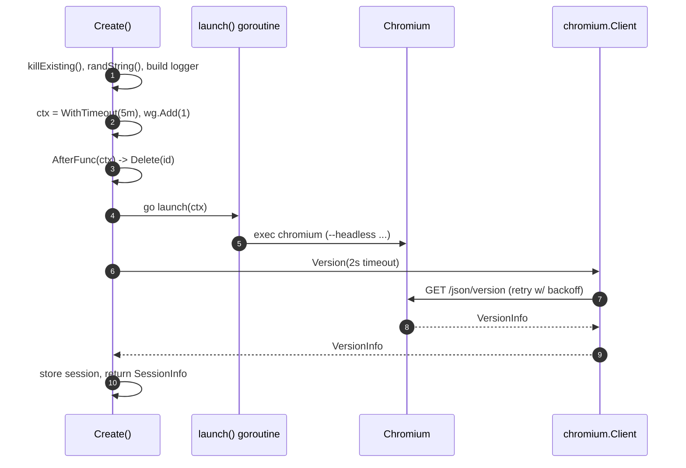

# Supervisor: session lifecycle & Chromium launch

**Source:** `internal/crocochrome/crocochrome.go`
(observability helpers in `proc.go` and `cgroup.go` are documented in
[observability.md](observability.md))

## Overview

The `Supervisor` is the heart of Crocochrome. It owns the lifecycle of browser
sessions: it launches Chromium as a subprocess, waits for it to become ready,
tracks it, enforces a timeout, and kills it (and its whole process tree) on
demand or on shutdown. It also computes the patched user agent and records
session metrics.

The defining rule, enforced here: **only one session may exist at a time.**
There are two ways to create a session, differing in how a conflict is
resolved: `Create` kills any other session that exists (legacy semantics),
while `CreateIfFree` fails with `ErrSessionExists` and never touches the
running session (the atomic acquire used by pool clients via
`POST /sessions/acquire`).

## Core types

| Type                   | Role                                                                                                   |
|------------------------|--------------------------------------------------------------------------------------------------------|
| `Supervisor`           | the supervisor; holds the sessions map, mutex, metrics, chromium client, patched UA, and a `WaitGroup` |
| `Options`              | construction-time configuration (see table below)                                                      |
| `session` (unexported) | per-session state: `*SessionInfo`, a `context.CancelFunc`, and a session-scoped `*slog.Logger`         |
| `SessionInfo`          | the public per-session value returned to clients: `ID` + `chromium.VersionInfo`                        |
| `CheckInfo`            | metadata about the SM check that triggered the session (`type` + `metadata` map)                       |

### `Supervisor` internals

```go
type Supervisor struct {
    opts        Options
    logger      *slog.Logger
    cclient     *chromium.Client
    sessions    map[string]session   // ID -> session
    sessionsMtx sync.Mutex           // guards sessions
    metrics     *metrics.SupervisorMetrics
    userAgent   string               // patched UA, computed once
    wg          *sync.WaitGroup      // tracks active sessions; Wait() blocks on it
    draining    atomic.Bool          // set by Drain(); creations fail with ErrDraining
}
```

The map is used even though only one session can exist, deliberately: the API
and `Supervisor` are kept decoupled from the single-session decision so it can
be relaxed later without an API change. See the comment on the `sessions` field.

### `Options`

Defaults are applied by `withDefaults()` in `New`.

| Field                    | Default         | Purpose                                                           |
|--------------------------|-----------------|-------------------------------------------------------------------|
| `ChromiumPath`           | (required)      | path to the `chromium` executable                                 |
| `ChromiumPort`           | `"5222"`        | port Chromium listens on for the debug protocol                   |
| `SessionTimeout`         | `5m`            | hard cap; the browser is killed unconditionally after this        |
| `UserGroup`              | `0` (no switch) | UID/GID to run Chromium as; `0` means current user                |
| `TempDir`                | `os.TempDir()`  | writable dir under which per-session temp dirs are created        |
| `Registry`               | empty registry  | Prometheus registerer                                             |
| `ExtraUATerms`           | `""`            | appended to the patched user agent                                |
| `CgroupMemoryEventsPath` | auto-detected   | cgroup OOM counter file; see [observability.md](observability.md) |
| `EnableProcessMetrics`   | `false`         | per-process RSS collection at teardown                            |
| `ProcFSRoot`             | `/proc`         | proc filesystem root (overridable in tests)                       |

## Public API

| Function                  | Purpose                                                                                    |
|---------------------------|--------------------------------------------------------------------------------------------|
| `New(logger, opts)`       | apply defaults, build the chromium client and metrics, return `*Supervisor`               |
| `Session(id)`             | return the `*SessionInfo` for an ID, or `nil` (used by the WS proxy)                      |
| `Sessions()`              | return the list of active session IDs                                                     |
| `Create(checkInfo)`       | kill any existing session, launch Chromium, probe readiness, return `SessionInfo`         |
| `CreateIfFree(checkInfo)` | like `Create`, but fail with `ErrSessionExists` instead of killing an existing session    |
| `Delete(sessionID)`       | tear down a session (SIGKILL + teardown observability); returns `found`                   |
| `Drain()`                 | make all subsequent creations fail with `ErrDraining`; existing sessions unaffected       |
| `Wait()`                  | block until no sessions are running (used by graceful shutdown)                           |
| `SessionTimeout()`        | the resolved session timeout (used by `main.go` to derive the shutdown grace)             |
| `ComputeUserAgent(ctx)`   | launch Chromium once, read & patch its user agent                                         |

Both create variants share one unexported implementation (`create`), which
first rejects with `ErrDraining` when `Drain` has been called, then either
kills the existing session (`Create`) or rejects with `ErrSessionExists`
(`CreateIfFree`). Because `create` holds `sessionsMtx` for its whole duration,
`CreateIfFree` is a race-free check-and-create: concurrent acquires are
serialized and exactly one can win.

## Session lifecycle



### `Create` step by step

`Create` holds `sessionsMtx` for its whole duration. It:

1. Fails with `ErrDraining` if `Drain()` has been called. Then, in the
   `CreateIfFree` variant, fails with `ErrSessionExists` when the map is
   non-empty; otherwise calls `killExisting()` to cancel any sessions already
   in the map (logged as an error, since clients are expected to clean up
   after themselves).
2. Generates a random 12-hex-character ID (`randString()`).
3. Builds a session-scoped logger, enriching it with the allowlisted metadata
   keys `regionID`, `tenantID`, and `id` (`allowedLabels`). These three together
   identify the organization responsible for the check. (Casing matches what the
   synthetic-monitoring-agent sends, not the protobuf casing — see the comment
   on `allowedLabels`.)
4. Creates a `context.WithTimeout(..., SessionTimeout)` and `wg.Add(1)`.
5. Registers `context.AfterFunc(ctx, ...)` that calls `Delete(id)` when the
   context ends — covering the **natural timeout** case. (Calling `Delete` twice
   is safe: it is a no-op when the session is already gone.)
6. Spawns a goroutine running `launch(ctx, logger)` (and `wg.Done()` on exit).
   It does **not** wait on `launch`'s error here; readiness is checked by probing.
7. Probes Chromium with a 2-second timeout via
   `cclient.Version(ctx, localhost:port)`. On failure it cancels the session and
   returns the error (HTTP layer maps this to `500`).
8. On success, stores the `session` in the map, records the state transition
   (`session_active` gauge to 1, `sessions_created_total` incremented — see
   [observability.md](observability.md)), and returns the `SessionInfo`.



### `Delete` and the teardown race

`Delete` calls `takeSession(id)`, which under a single lock both removes the
session from the map **and** calls its `cancel()` (sending SIGKILL to the
Chromium process group). Doing both atomically closes a race: a concurrent
`Create` can never observe an empty map (and start a new Chromium on the same
port) while the old browser is still alive. Any concurrent caller sees either
the session present (and kills it) or absent with SIGKILL already in flight.

After cancellation, `Delete` calls `emitTeardownObservability(sess)`, which
collects per-process metrics if enabled. Because SIGKILL is non-blocking, the
process tree lingers briefly in `/proc` and `cgroup.procs`; the collectors treat
ENOENT (a process that exited mid-read) as an expected race and skip it. See
[observability.md](observability.md).

> Note on the two delete paths: the unexported `delete(id)` assumes the caller
> already holds the mutex and is used by `killExisting`. The exported `Delete`
> takes the lock itself (via `takeSession`) and is the one the HTTP layer
> calls; the timeout `AfterFunc` uses the same path via `deleteWithReason`.

Every removal path records the state transition atomically with the map
mutation, while still holding the mutex (`setSessionInactive(reason)`:
`session_active` gauge to 0 plus a `sessions_terminated_total{reason}`
increment). The reason reflects the path taken: `deleted` for an explicit
`Delete`, `timeout` when the session deadline fired, `replaced` when
`killExisting` terminated it. Updating under the lock matters: a freed slot
can be re-acquired immediately by a concurrent create, and updating metrics
outside the lock could publish "free" on a busy instance.

### Concurrency model

- `sessionsMtx` guards every read/write of `sessions`. Locks are held briefly
  and never nested, so there is no deadlock risk.
- `wg` counts active sessions: `wg.Add(1)` in `Create`, `wg.Done()` when the
  `launch` goroutine returns. `Wait()` blocks on it and is what graceful
  shutdown uses to drain sessions.
- `draining` is an `atomic.Bool` set by `Drain()` (never unset). Once set, the
  create paths fail with `ErrDraining`, so the session count is monotonically
  decreasing and `Wait()` is guaranteed to return within the session timeout.

## Launching Chromium

`launch(ctx, logger)` prepares a temp dir, builds the argument list, runs
Chromium **blocking until it exits**, and records metrics. Cancelling `ctx`
kills the process.

### Temp directory

`mkdirTemp()` creates a fresh directory under `TempDir` (creating `TempDir`
itself with mode `0755` if missing — `0700` would stop other users descending
into it) and `chown`s it to `UserGroup` when a non-zero UID/GID is configured.
Chromium is pointed at it via the `TMPDIR` environment variable, because the rest
of the container filesystem is read-only in production. The dir is removed with
`os.RemoveAll` when Chromium exits; a failure to remove it `panic`s, treated as a
sign of a bug or compromised sandbox.

### Arguments

The argument list lives inline in `launch`. The "required" set has been tested
to be necessary; the rest are believed beneficial but unproven.

| Flag                                                                                                 | Why                                                                                                           |
|------------------------------------------------------------------------------------------------------|---------------------------------------------------------------------------------------------------------------|
| `--headless`                                                                                         | no GUI                                                                                                        |
| `--remote-debugging-address=0.0.0.0`                                                                 | bind the debug listener                                                                                       |
| `--remote-debugging-port=<ChromiumPort>`                                                             | the CDP port (default 5222)                                                                                   |
| `--no-sandbox`                                                                                       | single instance running as an unprivileged user makes the sandbox redundant; see below                        |
| `--disable-dev-shm-usage`                                                                            | containers often have a tiny `/dev/shm`, which crashes Chromium ([crbug.com/715363](http://crbug.com/715363)) |
| `--disable-breakpad`, `--disable-crash-reporter`                                                     | no crash reporting                                                                                            |
| `--disable-3d-apis`                                                                                  | disable WebGL etc.                                                                                            |
| `--disable-audio-input`, `--disable-audio-output`                                                    | no audio                                                                                                      |
| `--disable-default-apps`                                                                             | no first-run app installation                                                                                 |
| `--disable-extensions`, `--disable-file-system`, `--disable-first-run-ui`, `--disable-notifications` | reduce surface/noise                                                                                          |
| `--disable-smooth-scrolling`                                                                         | save CPU                                                                                                      |
| `--user-agent=<patched UA>`                                                                          | only added when a patched UA has been computed                                                                |

### Dropping privileges

When `UserGroup != 0`, `launch` sets `cmd.SysProcAttr.Credential` with the UID
and GID so Chromium runs as that user (`nobody` in production). This relies on
the `cap_setuid`/`cap_setgid` capabilities on the binary; see
[security.md](security.md) and [capabilities.md](../capabilities.md).

### Metrics & OOM detection at launch

`launch` also drives most of the supervisor's telemetry: session duration, the
`finished`/`failed` execution counter, max RSS from `ProcessState.SysUsage()`,
and OOM-kill detection by sampling the cgroup counter before and after
`cmd.Run()`. The details (and the gotchas around baseline reads and counter
resets) are in [observability.md](observability.md).

## User agent patching

`ComputeUserAgent(ctx)` is called once at startup (from `main.go`). It launches
Chromium, reads its default UA via the readiness client, removes every
occurrence of the string `"Headless"`, optionally appends `ExtraUATerms`
(`"GrafanaSyntheticMonitoring"` in production), and stores the result in
`s.userAgent`. Every later `launch` passes it via `--user-agent`, so monitored
sites do not see a headless UA.

## When to update

- The set of Chromium flags in `launch` changes → update the arguments table
  (this is the most likely thing to drift).
- `Options` fields or their defaults change → update the `Options` table.
- The session-creation steps, the timeout, or the readiness-probe timeout
  change → update the `Create` walkthrough, the state diagram, and the sequence
  diagram.
- The locking/race design in `takeSession`/`Delete` changes → revise the
  "teardown race" and "concurrency model" sections, since correctness arguments
  depend on them.
- The single-session invariant is lifted → this affects the whole document and
  the [entry-point doc](../index.md); update both.
- The user-agent patching logic changes (e.g. a different string is stripped) →
  update the "User agent patching" section.

