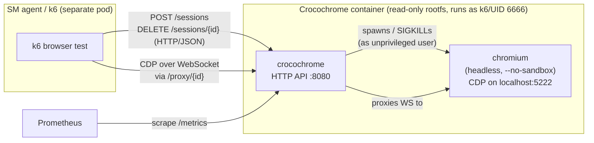
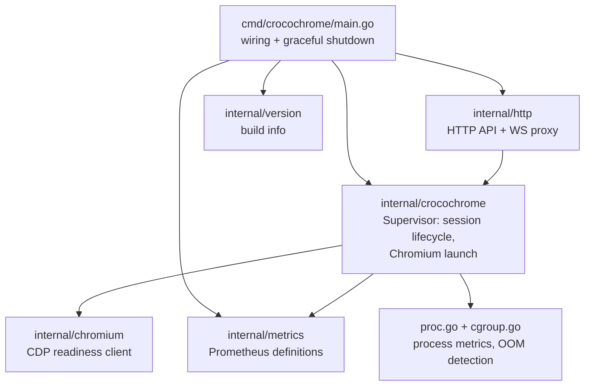

# Crocochrome architecture

This is the entry point to Crocochrome's architecture documentation. It gives
newcomers a high-level mental model of the system and then points to a set of
focused, per-component documents that contain the technical detail (file names,
types, functions) you need to work on the code.

If you have never seen this codebase before, read this page top to bottom, then
follow the links to whatever component you need to touch.

## What is Crocochrome?

Crocochrome is a **Chromium supervisor**: a small HTTP service that launches and
reaps [Chromium](https://www.chromium.org/) browser processes on demand. It is
the backend that powers **Grafana Synthetic Monitoring (SM) browser checks**.

A client (the [synthetic-monitoring-agent](https://github.com/grafana/synthetic-monitoring-agent) running [k6](https://k6.io/) browser tests) asks
Crocochrome to start a browser, receives back a WebSocket URL, drives the browser
over the [Chrome DevTools Protocol (CDP)](https://chromedevtools.github.io/devtools-protocol/), and then asks Crocochrome to tear
the browser down. Crocochrome owns the messy parts: running an untrusted browser
as an unprivileged user, cleaning up its process tree and temporary files,
enforcing timeouts, and reporting resource usage.

### The single most important constraint

**Crocochrome runs at most one browser session at a time.** Creating a new
session kills any existing one. This assumption shows up throughout the code,
the tests, and the security model. Keep it in mind while reading everything else.

## System context

Key points the diagram encodes:

- The client never talks to Chromium directly. Modern Chromium only binds its
  debugging port to `localhost`, so Crocochrome rewrites the debugger URL and
  **proxies** the WebSocket through its own `/proxy/{id}` endpoint.
- Crocochrome and Chromium live in the same container. Chromium's CDP port is
  not exposed outside the pod.
- Observability is pull-based: Prometheus scrapes `/metrics`.

## Component map

Each box below maps to a Go package (or a build artifact) and to a document in
this folder.

| Component                                       | Package / files                                                  | Document                                                                |
|-------------------------------------------------|------------------------------------------------------------------|-------------------------------------------------------------------------|
| Process entry point & lifecycle                 | `cmd/crocochrome/main.go`                                        | [entrypoint-and-lifecycle.md](architecture/entrypoint-and-lifecycle.md) |
| HTTP API & WebSocket proxy                      | `internal/http/http.go`                                          | [http-api.md](architecture/http-api.md)                                 |
| Supervisor (session lifecycle, Chromium launch) | `internal/crocochrome/crocochrome.go`                            | [supervisor.md](architecture/supervisor.md)                             |
| Chromium readiness client                       | `internal/chromium/chromium.go`                                  | [chromium-client.md](architecture/chromium-client.md)                   |
| Observability (metrics, logging, proc/cgroup)   | `internal/metrics/`, `internal/crocochrome/proc.go`, `cgroup.go` | [observability.md](architecture/observability.md)                       |
| Build, container & CI                           | `Dockerfile`, `Makefile`, `.github/workflows/`                   | [build-and-packaging.md](architecture/build-and-packaging.md)           |
| Security model                                  | (cross-cutting)                                                  | [security.md](architecture/security.md)                                 |
| Testing strategy                                | `*_test.go`, `internal/testutil/`, `integration/`                | [testing.md](architecture/testing.md)                                   |

### Reference docs (operational / design deep dives)

These pre-date this architecture set and remain authoritative for their topics.
The architecture docs link to them rather than duplicate their content.

- [On linux capabilities](capabilities.md) — why Crocochrome needs file
  capabilities and how they interact with Kubernetes `securityContext`.
- [On chromium sandboxing](chromium-sandbox.md) — the full rationale for running
  Chromium with `--no-sandbox`, including `strace` analysis.
- [Chromium Observability](chromium-observability.md) — operational guide to the
  per-process memory and OOM telemetry.

## Cross-cutting concerns at a glance

### Protocols & data formats

| Boundary                            | Protocol                 | Notes                                         |
|-------------------------------------|--------------------------|-----------------------------------------------|
| Client → Crocochrome API            | HTTP/1.1 + JSON          | `GET/POST /sessions`, `DELETE /sessions/{id}` |
| Client → Chromium (via Crocochrome) | WebSocket carrying CDP   | proxied through `/proxy/{id}`                 |
| Crocochrome → Chromium (readiness)  | HTTP GET `/json/version` | polled until ready                            |
| Prometheus → Crocochrome            | HTTP GET `/metrics`      | Prometheus text/exposition format             |

### Network boundaries

- **`:8080`** — the only listening port, serving both the API (`/`) and
  `/metrics`. Hardcoded in `cmd/crocochrome/main.go`.
- **Chromium debug port (default `5222`)** — Chromium is told to listen on
  `0.0.0.0:5222`, but it is reached only via `localhost` from within the
  container and is never exposed outside the pod. Clients reach it solely
  through the WebSocket proxy.
- In production, a Kubernetes `NetworkPolicy` is expected to block Crocochrome
  from reaching private IP ranges. See [security.md](architecture/security.md).

### External dependencies (`go.mod`)

Crocochrome deliberately keeps a minimal direct dependency set (no web
framework; routing uses the standard-library `http.ServeMux`).

| Module                                        | Used for                                            |
|-----------------------------------------------|-----------------------------------------------------|
| `github.com/koding/websocketproxy`            | WebSocket proxy in `internal/http` (`/proxy/{id}`)  |
| `github.com/prometheus/client_golang`         | metric definitions and the `/metrics` handler       |
| `github.com/prometheus/procfs`                | reading `/proc` and cgroup files (proc/OOM metrics) |
| `github.com/testcontainers/testcontainers-go` | integration tests only                              |
| `golang.org/x/sync`                           | `errgroup` for the graceful-shutdown goroutines     |

### OS-specific dependencies (Linux only)

Crocochrome targets Linux and relies on several Linux-specific facilities:

- **Linux capabilities** (`cap_setuid`, `cap_setgid`, `cap_kill`, `cap_chown`,
  `cap_dac_override`, `cap_fowner`) set on the binary via `setcap`.
- **`syscall.SysProcAttr.Credential`** to drop privileges when launching
  Chromium as another UID/GID.
- **`/proc`** parsing for per-process RSS and process-type classification.
- **cgroups v1 and v2** for OOM-kill detection and cgroup-level memory totals.
- **`TMPDIR`** redirection so Chromium writes only under a writable temp dir
  (the rest of the rootfs is read-only).

### Observability

- **Metrics** under the `sm_crocochrome_*` namespace (Prometheus).
- **Structured JSON logs** via `log/slog`, enriched per session with
  `regionID`, `tenantID`, and check `id`.
- **Optional per-process memory telemetry** at session teardown (`-process-metrics`).

See [observability.md](architecture/observability.md) for the full picture.

## When to update this document

Update this entry point when a change alters the **shape of the system**, not
just an implementation detail:

- A new top-level package/component is added or an existing one is removed or
  merged → update the component map diagram and table.
- The single-session constraint changes → update the "most important constraint"
  section and warn readers, since many other docs depend on it.
- A new network boundary, listening port, or protocol is introduced → update the
  system-context diagram and the protocols/network tables.
- A direct dependency is added to or removed from `go.mod` → update the external
  dependencies table.
- A new cross-cutting OS dependency is introduced → update the OS-specific
  dependencies list.

For changes local to a single component, update that component's document
instead (and only touch this page if one of the summary tables above goes stale).

